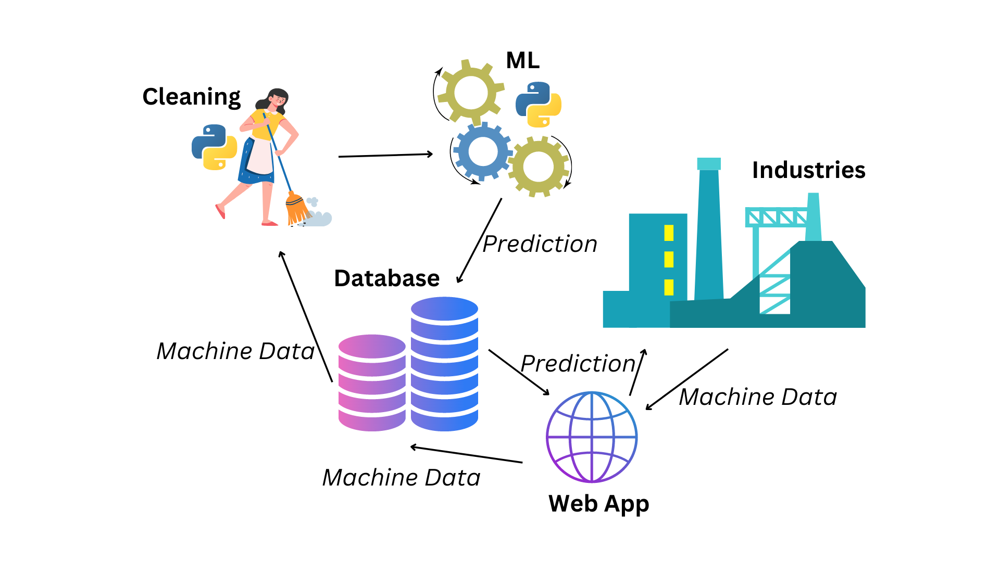
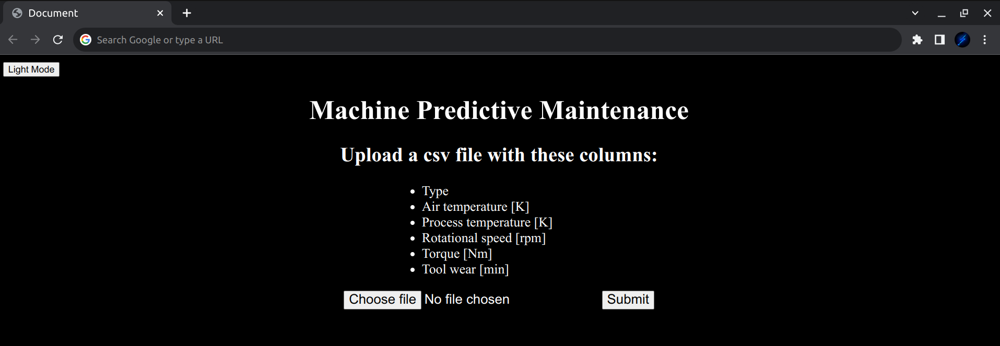

# Machine Predictive Maintenance for Industrial Machines

EDA and Machine Learning: [Jupyter Notebook](main.ipynb) 

Dataset link: [Kaggle Dataset](https://www.kaggle.com/datasets/shivamb/machine-predictive-maintenance-classification)



## Download Repository

```
git clone --depth 1 https://github.com/Adhiban1/feynn-labs.git
```

## Change directory

```
cd feynn-labs/project1
```

## Create virtual environment

```
python -m venv .venv
```

## Activate virtual environment

For windows
```
.venv/Scripts/activate 
```

For linux
```
source .venv/bin/activate
```

## Install requirements

```
pip install -r requirements.txt
```

## Train

Run `train.py` this will train the model and save the models into `models` folder

```
python src/train.py
```

## Test

Run `test.py` to verify saved models work well

```
python src/test.py
```

## App

Run `app.py` to open Web app

```
python src/app.py
```

# Setup

You can run above commands one by one or you can use `setup/setup.sh` for linux or `setup/setup.bat` for windows. You should modify the code in setup.sh or setup.bat file for your cases. And then run this one file this will download repository, change directory, creating virtual environment, activating virtual environment, upgrading pip, installing requirements, training the model, testing the model, opening Flask App.

> Once you run `setup` file, then don't run again to open flask app. Just run `run/run.bat` for windows or `.run/run.sh` for linux or you can activate `.venv` manually and run `app.py`.

Download `setup` file and modify it according to your needs and run this.

## Windows

```
D:\test>dir
setup.bat

D:\test>setup.bat
"Git Cloning..."
Cloning into 'feynn-labs'...
...
...
```

## Linux

```
adhiban@DESKTOP:/test$ ls
setup.sh
adhiban@DESKTOP:/test$ bash setup.sh
Git Cloning...
Cloning into 'feynn-labs'...
...
...
```

Dark mode:



Light mode:


# Input Data

```python
>>> df = pd.read_csv('predictive_maintenance.csv')
>>> df.head()
   UDI Product ID Type  Air temperature [K]  ...  Torque [Nm]  Tool wear [min]  Target  Failure Type
0    1     M14860    M                298.1  ...         42.8                0       0    No Failure
1    2     L47181    L                298.2  ...         46.3                3       0    No Failure
2    3     L47182    L                298.1  ...         49.4                5       0    No Failure
3    4     L47183    L                298.2  ...         39.5                7       0    No Failure
4    5     L47184    L                298.2  ...         40.0                9       0    No Failure

[5 rows x 10 columns]
>>> df.columns
Index(['UDI', 'Product ID', 'Type', 'Air temperature [K]',
       'Process temperature [K]', 'Rotational speed [rpm]', 'Torque [Nm]',
       'Tool wear [min]', 'Target', 'Failure Type'],
      dtype='object')
```

# Output Data

```python
>>> output = pd.read_csv('output.csv')
>>> output.head()
   UDI Product ID Type  ...  Failure Type  is_failure  failure_type
0    1     M14860    M  ...    No Failure           0    No Failure
1    2     L47181    L  ...    No Failure           0    No Failure
2    3     L47182    L  ...    No Failure           0    No Failure
3    4     L47183    L  ...    No Failure           0    No Failure
4    5     L47184    L  ...    No Failure           0    No Failure

[5 rows x 12 columns]
>>> output.columns
Index(['UDI', 'Product ID', 'Type', 'Air temperature [K]',
       'Process temperature [K]', 'Rotational speed [rpm]', 'Torque [Nm]',
       'Tool wear [min]', 'Target', 'Failure Type', 'is_failure',
       'failure_type'],
      dtype='object')
```

Here `failure_type`, `is_failure` columns are added in `output.csv`

> I give the same training dataset to the Flask app to check whether it predicts correct or not. Thats why `Target`, `Failure Type` and other columns are displayed in the terminal output.