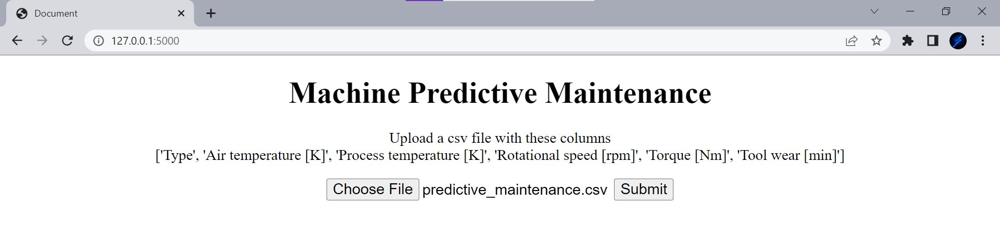

# Machine Predictive Maintenance

[Dataset Kaggle link](https://www.kaggle.com/datasets/shivamb/machine-predictive-maintenance-classification)

## Download Repository

```
git clone https://github.com/Adhiban1/feynn-labs.git
```

## Change directory

```
cd feynn-labs/project1
```

## Create virtual environment

```
python -m venv .venv
```

## Activate virtual environment

For windows
```
.venv/Scripts/activate 
```

For linux
```
source .venv/bin/activate
```

## Install requirements

```
pip install -r requirements.txt
```

## Train

Run `train.py` this will train the model and save the models into `models` folder

```
python train.py
```

## Test

Run `test.py` to verify saved models work well

```
python.test.py
```

## App

Run `app.py` to open Web app

```
python app.py
```

